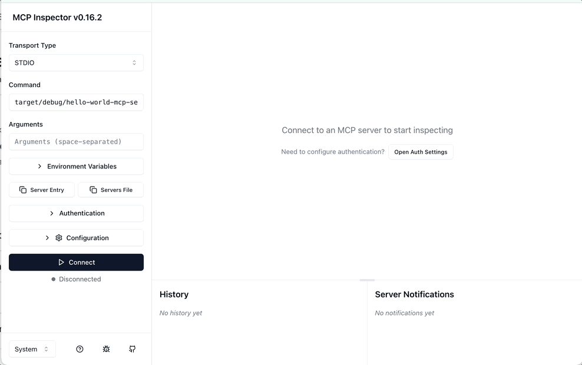

# Hello World MCP Server (Core)

A basic MCP server implementation featuring two custom tools: `Say Hello` and `Say Goodbye` , utilizing [rust-mcp-sdk](https://github.com/rust-mcp-stack/rust-mcp-sdk)

## Overview

This project showcases a fundamental MCP server implementation, highlighting the capabilities of
[rust-mcp-sdk](https://github.com/rust-mcp-stack/rust-mcp-sdk) with these features:

- Standard I/O transport
- Custom server handler
- Basic server capabilities

## Running the Example

1. Clone the repository:

```bash
git clone git@github.com:rust-mcp-stack/rust-mcp-sdk.git
cd rust-mcp-sdk
```

2. Build the project:

```bash
cargo build -p hello-world-mcp-server-stdio-core --release
```

3.  After building the project, the binary will be located at `target/release/hello-world-mcp-server-stdio-core`
    You can test it with [MCP Inspector](https://modelcontextprotocol.io/docs/tools/inspector), or alternatively, use it with any MCP client you prefer.

```bash
npx -y @modelcontextprotocol/inspector ./target/release/hello-world-mcp-server-stdio-core
```

```
Starting MCP inspector...
⚙ Proxy server listening on port 6277
🔍 MCP Inspector is up and running at http://127.0.0.1:6274 🚀
```

Here you can see it in action :

![hello-world-mcp-server-stdio-core]
